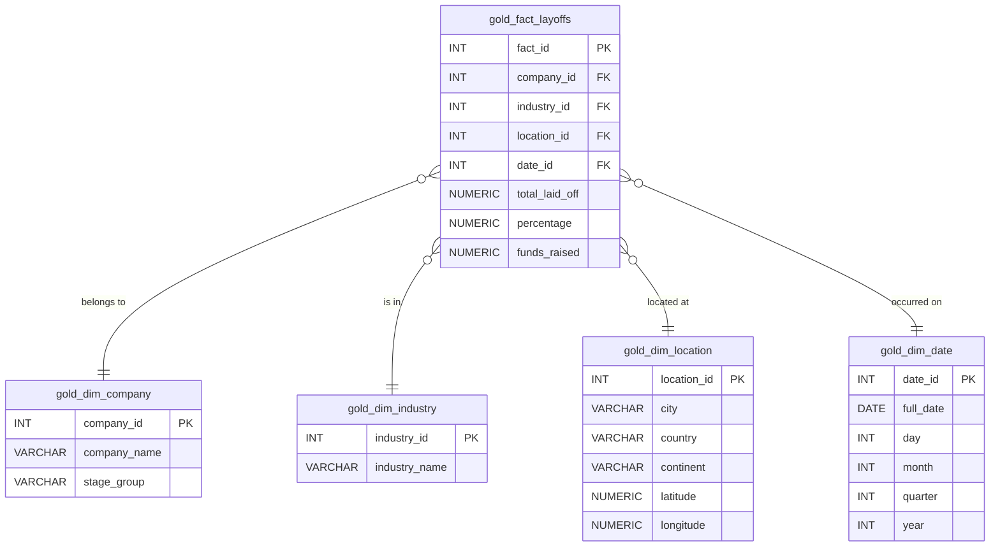

# Tech Layoffs Research Data Warehouse (2020-2025)

## 📌 Project Overview
This project transforms a dataset of tech layoffs from a flat bronze layer into an optimized **Star Schema (Gold Layer)** in PostgreSQL. This allows for improved analytics, BI reporting, and querying regarding tech company layoffs across industries, stages, and locations.

## 🏗 Architecture
The data pipeline implements a Medallion Architecture:
* **Bronze Layer**: Raw data ingestion (`public.bronze_tech_layoffs`). Executed via Python/Marimo (`PythonIngestion.py`).
* **Silver Layer**: Data cleansing and standardization (`silver.layoffs_standardized`). Normalizes industries and categorizes funding stages.
* **Gold Layer**: Dimensional Modeling (Star Schema). Contains isolated dimensions and a central fact table.

## 📊 Entity-Relationship Diagram (Gold Layer)
Below is the ERD for the Gold Layer Star Schema:



## 🛠 Data Transformations
### 1. Data Audit & Silver Layer
- **Schema Creation**: Segregates raw from refined data into `silver` and `gold`.
- **Industry Normalization**: Fixes typos ('Transportion' -> 'Transportation') and groups financial branches into 'Fintech'.
- **Funding Stage Grouping**: Evaluates the diverse `Stage` column and consolidates them into broader groups (`Early Stage`, `Growth Stage`, `Late Stage`, `Mature/Public`, or `Other`).
- **Data Casting**: Dates handled and cast strictly via `::DATE`.

### 2. Dimensional Modeling (Gold Layer)
Transformed `silver.layoffs_standardized` into dimension tables:
1. `dim_company`: Maps company names and current stage groupings.
2. `dim_industry`: Cleaned distinct industry categories.
3. `dim_location`: Denormalized geography grouping city, country, continent, and geospatial coordinates.
4. `dim_date`: Extracted day, month, quarter, year metrics mapped against full layoff dates.
5. `fact_layoffs`: The center mapping IDs to qualitative metrics (`total_laid_off`, `percentage`, `funds_raised`).

### 3. Data Validation
- `NULL` layoff counts are treated as `0` during aggregation to prevent SQL aggregation drops while maintaining logical consistency.
- Successfully achieved parity checksum between Bronze layout (`SUM(Laid_Off)`) and Fact layout (`SUM(total_laid_off)` => **581,705** matching records confirmed).

## 🚀 Execution Instructions
1. Ensure the PostgreSQL backend is live using Docker:
   ```bash
   docker-compose up -d
   ```
2. Ingest raw data:
   Run `PythonIngestion.py` notebook.
3. Execute pipeline transforms:
   ```bash
   Get-Content pipeline.sql | docker exec -i postgres_layoffs psql -U admin -d tech_layoffs_dw
   ```
4. Verify checksums:
   ```bash
   docker exec -i postgres_layoffs psql -U admin -d tech_layoffs_dw -c "SELECT sum(""Laid_Off"") FROM public.bronze_tech_layoffs; SELECT sum(total_laid_off) FROM gold.fact_layoffs;"
   ```